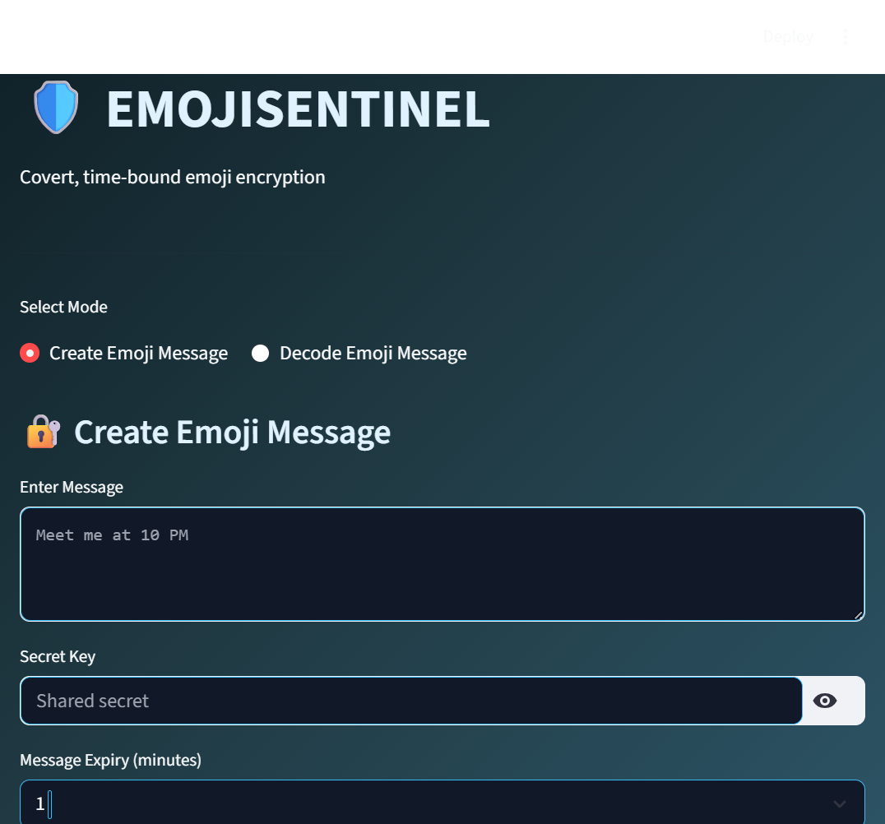

# 🛡️ EMOJISENTINEL

> Covert, time-bound communication using strong cryptography and emoji-based transport.

---

## 🔥 What is EMOJISENTINEL?

**EMOJISENTINEL** is a **security-first Streamlit prototype** that allows users to convert plaintext messages into **encrypted emoji sequences**.

Only a receiver with:
- the **correct secret key**
- and **within the expiry time**

can decode the original message.

> Emojis are **not** the security.  
> Cryptography **is**.

---

## 🧠 Why This Exists

Most emoji encoders are just **obfuscation**.  
EMOJISENTINEL is different:

- 🔐 Real encryption (AES-GCM)
- 🔑 Secure key derivation (PBKDF2)
- ⏳ Time-bound message expiry
- 🧩 Key-dependent emoji mapping
- 🛡️ Tamper detection built-in

This project demonstrates **secure system design**, not gimmicks.

---

## ⚙️ How It Works

### 🔐 Sender Flow
1. Enter a plaintext message
2. Enter a **secret key**
3. Select expiry time (in minutes)
4. Message is:
   - Encrypted using **AES-GCM**
   - Key derived via **PBKDF2**
   - Encoded into a **key-shuffled emoji sequence**
5. Sender shares **only emojis**

---

### 🔓 Receiver Flow
1. Paste the emoji sequence
2. Enter the **same secret key**
3. System verifies:
   - Integrity (tamper detection)
   - Expiry validity
4. Message is revealed **only if valid**

Wrong key, modified emojis, or expired message → ❌ Access denied

---

## 🔒 Security Design

- **AES-GCM** — confidentiality + integrity
- **PBKDF2** — protects against brute-force keys
- **Key-shuffled emoji mapping** — defeats pattern analysis
- **Encrypted metadata** — expiry cannot be bypassed
- **No server storage** — zero retention design

See [`threat_model.md`](threat_model.md) for full analysis.

---

## 🖥️ UI Philosophy

- 🕶️ Hacker-style dark theme
- 👁️ High contrast, fully readable
- 🧪 SOC-dashboard inspired
- ❌ No neon abuse, no eye strain

Designed to look like a **real security tool**, not a movie hack.

---

## 🧪 Testing

Minimal but meaningful tests included:
- Encryption ↔ decryption correctness
- Wrong key failure
- Emoji tampering detection

Security logic is tested — UI is intentionally not.

---

## 🚀 Tech Stack

- **Python**
- **Streamlit**
- **cryptography** (AES-GCM, PBKDF2)
- **pytest**

---

## ⚠️ Disclaimer

EMOJISENTINEL is an **educational security prototype**.

It is **not** intended to replace production-grade secure messengers like Signal or WhatsApp.

No claims of “unbreakable” or “military-grade” security are made.

---

## 📜 License

MIT License © Shivam
